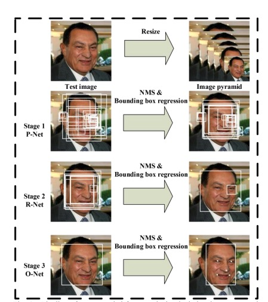
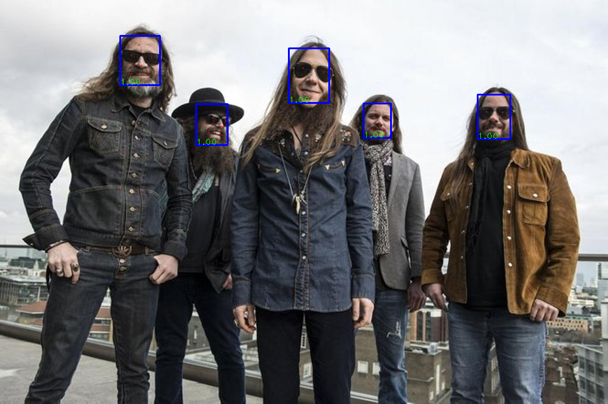

---
tasks:
- face-detection
widgets:
  - task: face-detection
    inputs:
      - type: image
    examples:
      - name: 1
        inputs:
          - data: https://modelscope.oss-cn-beijing.aliyuncs.com/test/images/mtcnn_face_detection.jpg
    inferencespec:
      cpu: 4
      gpu: 1
      gpu_memory: 16000
      memory: 43000
domain:
- cv
frameworks:
- pytorch
backbone:
- Manual
metrics:
- AP
license: MIT License
tags:
- MTCNN
datasets:
  train:
  - shaoxuan/WIDER_FACE
  evaluation:
  - shaoxuan/WIDER_FACE

---

# MTCNN 模型介绍
稳定调用及效果更好的API，详见视觉开放智能平台：[人脸检测与五官定位](https://vision.aliyun.com/experience/detail?tagName=facebody&children=DetectFace&spm=a2cio.27993362)。

人脸检测关键点模型MTCNN


## 模型描述

MTCNN是工业界广泛应用的检测关键点二合一模型, ([论文地址](https://arxiv.org/abs/1604.02878), [代码地址](https://github.com/TropComplique/mtcnn-pytorch))，该方法包含下面4个模块:
- Image Pyramid: 首先将图像进行不同尺度的变换，构建图像金字塔，以适应不同大小的人脸的进行检测;
- Proposal Network: 其基本的构造是一个全卷积网络。对上一步构建完成的图像金字塔，通过一个FCN进行初步特征提取与标定边框，并进行Bounding-Box Regression调整窗口与NMS进行大部分窗口的过滤。
- Refine Network: 其基本的构造是一个卷积神经网络，相对于第一层的P-Net来说，增加了一个全连接层，因此对于输入数据的筛选会更加严格。在图片经过P-Net后，会留下许多预测窗口，我们将所有的预测窗口送入R-Net，这个网络会滤除大量效果比较差的候选框，最后对选定的候选框进行Bounding-Box Regression和NMS进一步优化预测结果;
- Output Network: 基本结构是一个较为复杂的卷积神经网络，相对于R-Net来说多了一个卷积层。O-Net的效果与R-Net的区别在于这一层结构会通过更多的监督来识别面部的区域，而且会对人的面部特征点进行回归，最终输出五个人脸面部特征点。


MTCNN的结构如下：



## 模型效果


## 模型使用方式和使用范围
本模型可以检测输入图片中人脸和对应5点关键点的位置。

### 使用方式
- 推理：输入图片，如存在人脸则返回人脸位置和五点关键点，可检测多张人脸


### 目标场景
- 人脸相关的基础能力，可应用于人像美颜/互动娱乐/人脸比对等场景

### 模型局限性及可能偏差
- 小脸的检测效果一般
- 早期经典的检测关键点二合一model，可能模型结构存在些冗余的部分
- 当前版本在python 3.7环境测试通过，其他环境下可用性待测试

#### 代码范例
```python
from modelscope.pipelines import pipeline
from modelscope.utils.constant import Tasks

mtcnn_face_detection = pipeline(Tasks.face_detection, 'damo/cv_manual_face-detection_mtcnn')
img_path = 'https://modelscope.oss-cn-beijing.aliyuncs.com/test/images/mtcnn_face_detection.jpg'
result = mtcnn_face_detection(img_path)
print('face detection output: {}.'.format(result))

# if you want to show the result, you can run
from modelscope.utils.cv.image_utils import draw_face_detection_result
from modelscope.preprocessors.image import LoadImage
import cv2

img = LoadImage.convert_to_ndarray(img_path)
cv2.imwrite('srcImg.jpg', img)
img_draw = draw_face_detection_result('srcImg.jpg', result)
cv2.imwrite('result.jpg', img_draw)
import matplotlib.pyplot as plt
plt.imshow(img_draw)
```

### 模型训练流程
- 在Wider Face数据集上训练，优化器为SGD。

### 测试集
- WIDERFACE: 测试集已上传至ModelScope的DatasetHub, 详情请见[WIDER_FACE](https://modelscope.cn/datasets/shaoxuan/WIDER_FACE)。

## 数据评估及结果
模型在WiderFace的验证集上客观指标如下：
| Method | Easy | Medium | Hard |
| ------------ | ------------ | ------------ | ------------ |
| MTCNN | 85.1 | 82.0 | 60.7 |
## 人脸相关模型

以下是ModelScope上人脸相关模型:

- 人脸检测

| 序号 | 模型名称 |
| ------------ | ------------ |
| 1 | [RetinaFace人脸检测模型](https://modelscope.cn/models/damo/cv_resnet50_face-detection_retinaface/summary) |
| 2 | [MogFace人脸检测模型-large](https://modelscope.cn/models/damo/cv_resnet101_face-detection_cvpr22papermogface/summary) |
| 3 | [TinyMog人脸检测器-tiny](https://modelscope.cn/models/damo/cv_manual_face-detection_tinymog/summary) |
| 4 | [ULFD人脸检测模型-tiny](https://modelscope.cn/models/damo/cv_manual_face-detection_ulfd/summary) |
| 5 | [Mtcnn人脸检测关键点模型](https://modelscope.cn/models/damo/cv_manual_face-detection_mtcnn/summary) |
| 6 | [ULFD人脸检测模型-tiny](https://modelscope.cn/models/damo/cv_manual_face-detection_ulfd/summary) |


- 人脸识别

| 序号 | 模型名称 |
| ------------ | ------------ |
| 1 | [口罩人脸识别模型FaceMask](https://modelscope.cn/models/damo/cv_resnet_face-recognition_facemask/summary) |
| 2 | [口罩人脸识别模型FRFM-large](https://modelscope.cn/models/damo/cv_manual_face-recognition_frfm/summary) |
| 3 | [IR人脸识别模型FRIR](https://modelscope.cn/models/damo/cv_manual_face-recognition_frir/summary) |
| 4 | [ArcFace人脸识别模型](https://modelscope.cn/models/damo/cv_ir50_face-recognition_arcface/summary) |
| 5 | [IR人脸识别模型FRIR](https://modelscope.cn/models/damo/cv_manual_face-recognition_frir/summary) |

- 人脸活体识别

| 序号 | 模型名称 |
| ------------ | ------------ |
| 1 | [人脸活体检测模型-IR](https://modelscope.cn/models/damo/cv_manual_face-liveness_flir/summary) |
| 2 | [人脸活体检测模型-RGB](https://modelscope.cn/models/damo/cv_manual_face-liveness_flrgb/summary) |
| 3 | [静默人脸活体检测模型-炫彩](https://modelscope.cn/models/damo/cv_manual_face-liveness_flxc/summary) |

- 人脸关键点

| 序号 | 模型名称 |
| ------------ | ------------ |
| 1 | [FLCM人脸关键点置信度模型](https://modelscope.cn/models/damo/cv_manual_facial-landmark-confidence_flcm/summary) |

- 人脸属性 & 表情


| 序号 | 模型名称 |
| ------------ | ------------ |
| 1 | [人脸表情识别模型FER](https://modelscope.cn/models/damo/cv_vgg19_facial-expression-recognition_fer/summary) |
| 2 | [人脸属性识别模型FairFace](https://modelscope.cn/models/damo/cv_resnet34_face-attribute-recognition_fairface/summary) |

## 来源说明
本模型及代码来自开源社区([地址](https://github.com/TropComplique/mtcnn-pytorch))，请遵守相关许可。

## 引用
如果你觉得这个该模型对有所帮助，请考虑引用下面的相关的论文：

```BibTeX
@inproceedings{xiang2017joint,
      title={Joint face detection and facial expression recognition with MTCNN},
        author={Xiang, Jia and Zhu, Gengming},
          booktitle={2017 4th international conference on information science and control engineering (ICISCE)},
            pages={424--427},
              year={2017},
                organization={IEEE}
}
```

